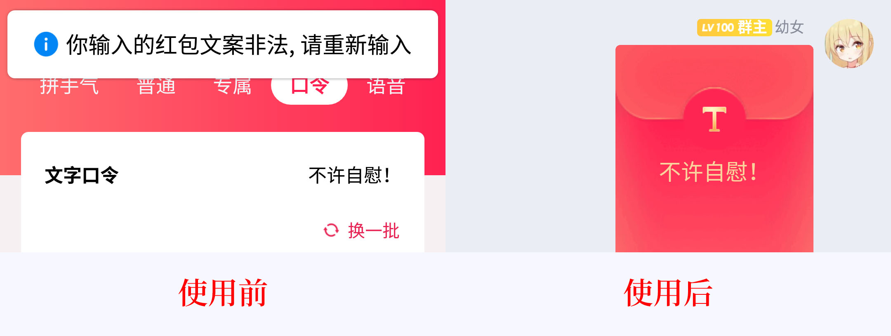

# 【幼女Code】反和谐超级武器！

你还在因为在群名里加入色图而被QQ改成一个「*」而苦恼吗？你还在因为在红包祝福里写「年轻人好好自慰」而白白花钱吗？

快使用**幼女Code**吧！

**幼女Code**使用Librian幼女娱乐中心最新研发的**unvcode**，可以快速解决你的一切问题！


## 原理

在unicode中<sub>(注意这不是unvcode)</sub>，有很多字，它们看起来长得很像，但是它们的ord不一样。

这样一来，只要把字符串里原本的字……啊，点到为止，再说下去就不好玩了。

## 效果



**幼女Code**真是太棒了！

## 在线Demo

<https://unvcode.librian.net/html/main.html>

因为JS处理图像很麻烦，所以这是把中间结果打表到代码里的，如果和Python的输出对不齐是正常现象。

## 接口

```python
def unvcode(s: str, skip_ascii=True, mse=0.1) -> Tuple[str, Tuple[float, ...]]:
```

输入一个字符串，返回改变后的字符串、每个字符被改变后与原本的像素差异<sub>(没变就是None)</sub>。

如果`skip_ascii`开启则会跳过ascii字符。

`mse`是字符相似度的阈值。

样例: 

```python
import unvcode
s, var = unvcode.unvcode('Librian幼女娱乐中心开业了，注册即送色图！')
print(s) 
print(var) 
```

输出: 
```text
Librian幼⼥娱乐㆗⼼开业了，注册即送⾊图！
(None, None, None, None, None, None, None, None, 0.0, None, None, 0.009146429779930796, 0.0, None, None, 0.0, None, None, None, None, None, 0.0, None, None)
```

注意，这句话看起来的样子取决于你的系统字体，所以我也不知道它会是什么样的……因为有一些字在A字体下看起来是一样的，但是在B字体下看起来就不一样。

默认的字体是思源宋体，思源宋体好啊。  
如果你要选择字体，比如用微软雅黑，那就`unvcode.font = 'msyh.ttc'`，顺便一提，我发现`YuGothM.ttc`的效果是最好的……

## 安装

```sh
pip install unvcode
```

然后在代码里`import unvcode`就行了，就是这么简单！


## 结束

如果你觉得幼女Code对你的工作或学习有所帮助，欢迎给作者送一些幼女过来。

